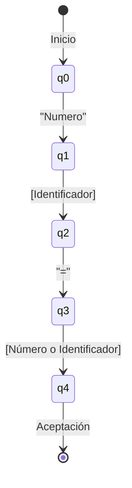
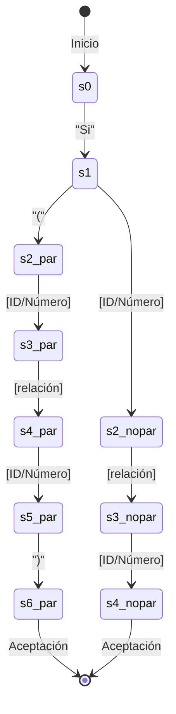
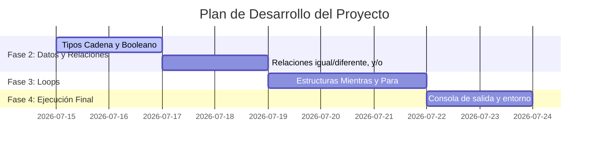

# Contexto y Plan de Implementación: Analizador de Pseudocódigo con Autómatas

UTILIZA SDD SIN TDD, IMPLEMENTA EN JAVA PURA Y DEPENDENCIAS ESCENCIALES PARA EL PROYECTO. el Codigo debe estar en español (camelCase) (variables, carpetas, funciones, etc). En el codigo solo comentarios puntuales y relevantes.

Instrucción Claude: Este documento describe el contexto, la arquitectura del software, el diseño de los Autómatas Finitos Deterministas (DFA) implementados, y la planificación de las siguientes fases del proyecto.

---

## 1. Contexto del Proyecto

El objetivo del proyecto es construir una aplicación en Java que permita escribir, analizar y ejecutar un pseudocódigo en español. La validación sintáctica de cada instrucción se realiza mediante la simulación de autómatas finitos (grafos dirigidos con estados y transiciones), mostrando la representación gráfica de dicho proceso en tiempo real para cada línea de código.

### Alcance de la Fase Actual (Fase 1)
- **Tipos de Datos**: Declaración de variables numéricas (`Numero`).
- **Estructuras Condicionales**: Estructuras `Si` y `SiNo`.
- **Relaciones**: Operadores relacionales de mayor y menor (`<`, `>`, `<=`, `>=`).
- **Visualización**: Renderizado gráfico interactivo del autómata correspondiente a la línea seleccionada en una lista.
- **Acciones**:
  - **Analizar**: Tokeniza y valida sintácticamente el pseudocódigo línea por línea.
  - **Ejecutar**: Interpreta las declaraciones de variables y condicionales para simular la ejecución.
  - **Limpiar**: Vacía la interfaz gráfica.
  - **Guardar**: Almacena el pseudocódigo en un archivo plano de texto.

---

## 2. Arquitectura del Sistema

El diseño sigue el patrón de separación de responsabilidades, dividiendo el análisis léxico/sintáctico, la representación matemática del autómata y la visualización de la interfaz en Swing:

```
┌─────────────────────────────────────────────────────────┐
│                    VentanaPrincipal                     │
│  (Interfaz de usuario: Editor, Lista de Líneas, Botones) │
└────────────┬───────────────────────────────┬────────────┘
             │                               │
             ▼                               ▼
    ┌─────────────────┐             ┌─────────────────┐
    │    Automata     │             │  PanelAutomata  │
    │ (Motor de DFA & │             │(Visualizador de │
    │    Parser)      │             │ Grafos en 2D)   │
    └────────┬────────┘             └─────────────────┘
             │
             ├───────────────┐
             ▼               ▼
        ┌─────────┐     ┌────────────┐
        │ Estado  │     │ Transicion │
        │ (Nodos) │     │  (Arcos)   │
        └─────────┘     └────────────┘
```

### Componentes de Software:
1. **[Estado.java]**: Define un estado $q$ con sus coordenadas de renderizado $(x, y)$, y flags de inicio, aceptación o error.
2. **[Transicion.java]**: Modela el enlace orientado entre un estado de origen y uno de destino bajo una etiqueta de token específica.
3. **[Automata.java]**: Clase encargada de tokenizar la línea, generar la estructura del grafo específico, simular las transiciones paso a paso y registrar el camino recorrido.
4. **[PanelAutomata.java]**: Extiende de `JPanel` y se encarga del renderizado 2D personalizado de círculos, doble círculos (aceptación) y flechas con etiquetas, coloreando el camino recorrido de forma dinámica.
5. **[VentanaPrincipal.java]**: Controlador e interfaz principal que conecta las acciones de edición, análisis, ejecución y guardado de archivos.

---

## 3. Especificación de Autómatas (DFAs)

### A. Declaración de Variables de tipo `Numero`
Sintaxis: `Numero <id> = <valor>` o `Numero <id> = <id>`



### B. Condicional `Si`
Sintaxis: `Si ( <término> <relación> <término> )` o `Si <término> <relación> <término>`



---

## 4. Plan de Trabajo Futuro (Fases Siguientes)

Para completar la especificación original del proyecto, se proponen las siguientes etapas de implementación:



### Fase 2: Soporte Completo de Tipos y Relaciones
1. **Nuevos Tipos de Variables**:
   - Agregar palabras clave `Cadena` y `Booleano`.
   - Modificar `Automata.java` para validar literales de texto entre comillas (ej. `"hola"`) y valores lógicos (`verdadero` / `falso`).
2. **Nuevas Relaciones**:
   - Incorporar relaciones de igualdad e inequidad (`==`, `!=`).
   - Agregar conectores lógicos `y` / `o` (operadores `&&` / `||`).

### Fase 3: Estructuras Cíclicas / Repetitivas
1. **Bucle `Mientras`**:
   - Sintaxis: `Mientras <condicion>`
   - Autómata con estados para verificar la expresión de control.
2. **Bucle `Para`**:
   - Sintaxis típica: `Para <id> = <inicio> Hasta <fin>` o similar.
   - Definición del DFA con transiciones para asignación inicial, límite y paso.

### Fase 4: Intérprete Completo y Ejecución Avanzada
1. **Ejecución de Bucles**:
   - Extender el intérprete básico de `VentanaPrincipal.java` para soportar saltos lógicos y ejecuciones repetitivas en memoria.
2. **Variables de Múltiple Tipo**:
   - Ampliar la tabla de símbolos para soportar tipos String y Boolean, realizando validaciones de tipo en tiempo de ejecución (Type Checking).
